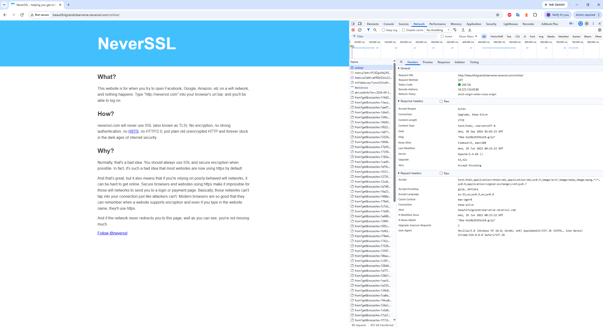

# Informe de Auditoría de Red Wi-Fi Insegura
## Parte 1 – Exploración de Tráfico Web (HTTP)

En esta primera etapa utilicé las herramientas de desarrollador del navegador (**F12**), específicamente la pestaña **Network (Red)**, para capturar e inspeccionar la primera petición realizada al cargar el sitio `http://neverssl.com`.

### Datos de la Petición

* **URL solicitada:** `http://beautifulgrandclearverse.neverssl.com/online/`
* **Método HTTP:** `GET`
* **Status Code:** `200 OK`
* **Host:** `beautifulgrandclearverse.neverssl.com`
* **Remote Address (IP y Puerto):** `34.223.124.45:80`
* **Protocolo utilizado:** `HTTP/1.1` (sin cifrado / texto plano sobre el puerto 80)

### Headers Enviados (Request Headers)

Entre las cabeceras enviadas por el navegador se destacan:
* **Host:** `beautifulgrandclearverse.neverssl.com`
* **User-Agent:** `Mozilla/5.0 (Windows NT 10.0; Win64; x64) AppleWebKit/537.36 (KHTML, like Gecko) Chrome/154.0.0.0 Safari/537.36`
* **Accept:** `text/html,application/xhtml+xml,application/xml;q=0.9,image/avif,image/webp,image/apng,*/*;q=0.8,...`
* **Accept-Encoding:** `gzip, deflate`
* **Accept-Language:** `es-ES,es;q=0.9,en;q=0.8`
* **Connection:** `keep-alive`
* **Upgrade-Insecure-Requests:** `1`

### Evidencia

## Parte 2 – Análisis

### 1. ¿Qué protocolo utiliza el sitio?
Utiliza **HTTP** sin cifrar (específicamente HTTP/1.1 por el puerto 80). En el navegador se ve claramente el cartel de *"Not secure"* al lado de la barra de direcciones, y en la pestaña de red no hay ningún certificado de seguridad ni capa TLS/SSL. 

### 2. ¿Qué información puede observarse durante la solicitud?
Cualquier persona que esté mirando la red puede ver los datos completos en texto plano:
* **La URL y el Host:** Se ve claramente la dirección exacta a la que ingresé (`http://beautifulgrandclearverse.neverssl.com/online/`) y el servidor de destino.
* **El método utilizado:** Se aprecia que se envió una petición `GET` para solicitar la página web.
* **El User-Agent y Headers:** Queda expuesto el navegador y sistema operativo exacto que uso (`Mozilla/5.0... Windows NT 10.0; Chrome/154.0.0.0`), junto con el idioma y las capacidades de compresión aceptadas (`Accept-Encoding: gzip, deflate`).

### 3. ¿Qué riesgos existen al navegar mediante HTTP desde una red Wi-Fi pública?
Al no tener cifrado, cualquier atacante conectado a la misma red puede usar un sniffer de paquetes (como Wireshark) o montar un ataque *Man-in-the-Middle* para espiar lo que hago. Podría interceptar:
* Formularios, usuarios, contraseñas o datos personales enviados.
* Cookies de sesión para clonarme la cuenta sin necesidad de saber la clave.
* Páginas vistas e historial de navegación.
* Incluso podría inyectar código malicioso en el sitio que estoy viendo para engañarme o infectar mi equipo.

### 4. ¿Cómo cambiaría este escenario utilizando una VPN?
Si conecto una VPN antes de entrar al sitio, la situación cambia por completo:
* **Túnel seguro y cifrado:** Se crea un túnel hermético entre mi máquina y el servidor de la VPN; todos los datos que salen de mi compu se cifran antes de tocar el aire de la red Wi-Fi.
* **Protección del tráfico:** Aunque el sitio final sea HTTP inseguro, el tramo peligroso (la red pública) queda blindado. Un atacante en la misma cafetería o aeropuerto solo vería paquetes cifrados incomprensibles.
* **Privacidad:** Mi dirección IP real queda oculta, ya que para Internet mi tráfico sale con la IP del servidor VPN, evitando que rastreen mi ubicación real o lo que visito desde esa red.

### 5. Mis 3 Reglas de Oro para navegar en redes Wi-Fi públicas
1. **Activar siempre una VPN de confianza** antes de conectar y transmitir cualquier dato para encapsular todo el tráfico en un canal cifrado.
2. **Revisar que los sitios usen HTTPS** (con el candadito) y jamás introducir contraseñas, tarjetas de crédito ni datos sensibles si la web figura como *"No segura"*.
3. **Desactivar la reconexión automática y el uso compartido de archivos:** Configurar la red en la computadora como "Red pública" para bloquear el descubrimiento de mi equipo y evitar que el dispositivo se una solo a redes abiertas desconocidas.
